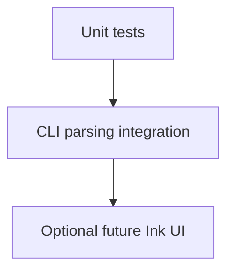

# Test Suite Plan

## Scope Decisions
- Runner: Bun test.
- Focus: unit tests + CLI parsing integration tests.
- Ink UI tests deferred to an optional later phase.

## Proposed Test Layout
```
tests/
  api/
  cli/
  utils/
  fixtures/
```

## Phased Plan
### Phase 1: Test Harness + Conventions
- Add a `test` script in [`package.json`](package.json) to run `bun test`.
- Create baseline folders under `tests/` for api, cli, utils, fixtures.
- Add shared helpers for temp dirs, env overrides, and fetch stubs.

### Phase 2: Unit Tests (Utilities + Config)
- [`src/utils/config.ts`](src/utils/config.ts): config defaults, read and write, history trimming behavior, and local override precedence.
- [`src/utils/image.ts`](src/utils/image.ts): filename generation, data URL conversion, and skip or guard OS-specific resize/open behavior.

### Phase 3: Unit Tests (API Layer)
- [`src/api/models.ts`](src/api/models.ts): model metadata, supported aspect ratios, and mapping for model-specific ratios.
- [`src/api/pricing.ts`](src/api/pricing.ts): cache read/write paths, fallback behavior when pricing API is unavailable, and currency metadata.
- [`src/api/fal.ts`](src/api/fal.ts): request payload construction and error handling using stubbed `fetch` responses.

### Phase 4: CLI Integration Tests (Parsing Focus)
- [`bin/falcon`](bin/falcon) + [`src/cli.ts`](src/cli.ts): `--help`, invalid option combinations, invalid values, and promptless commands that should fail fast without network calls.
- Validate exit codes and stderr/stdout text without snapshots.
- Stub external network calls so option parsing and validation can be tested without API access.

### Phase 5: Optional Ink UI Tests (Deferred)
- Add a minimal Ink rendering harness to exercise screen routing and input handling.
- Prefer component-level tests with mocked data/state; avoid end-to-end flows.

### Phase 6: Coverage + Maintenance
- Add a minimal set of regression tests for any bugs discovered.
- Document any skipped tests and why they are deferred.

## Coverage Map
| Area | Intent |
| --- | --- |
| utils | deterministic helpers, config and history behavior |
| api | model metadata, pricing fallback, request payloads |
| cli | argument parsing, validation, exit codes |

## Notes
- Keep fixtures small and representative in `tests/fixtures`.
- Avoid live API calls; stub `fetch` and use temp directories.
- Ink UI tests are optional and should be added only after unit and CLI coverage is stable.


